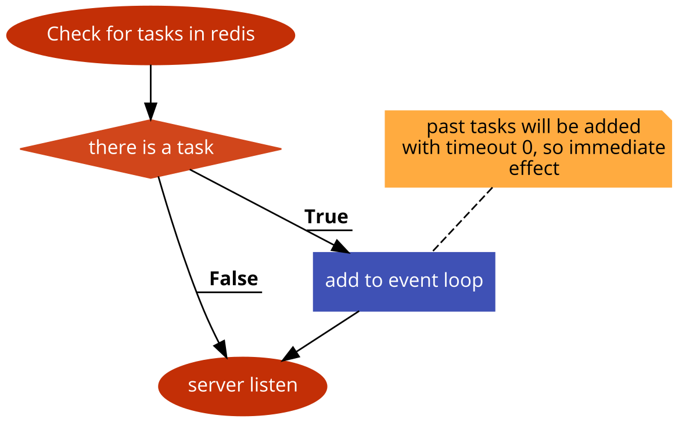
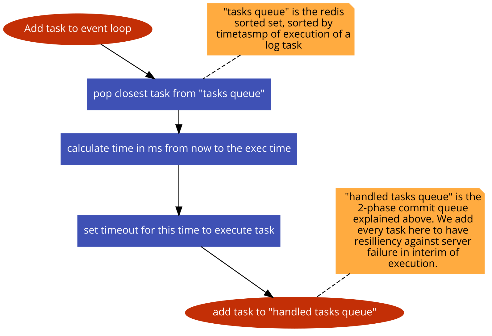
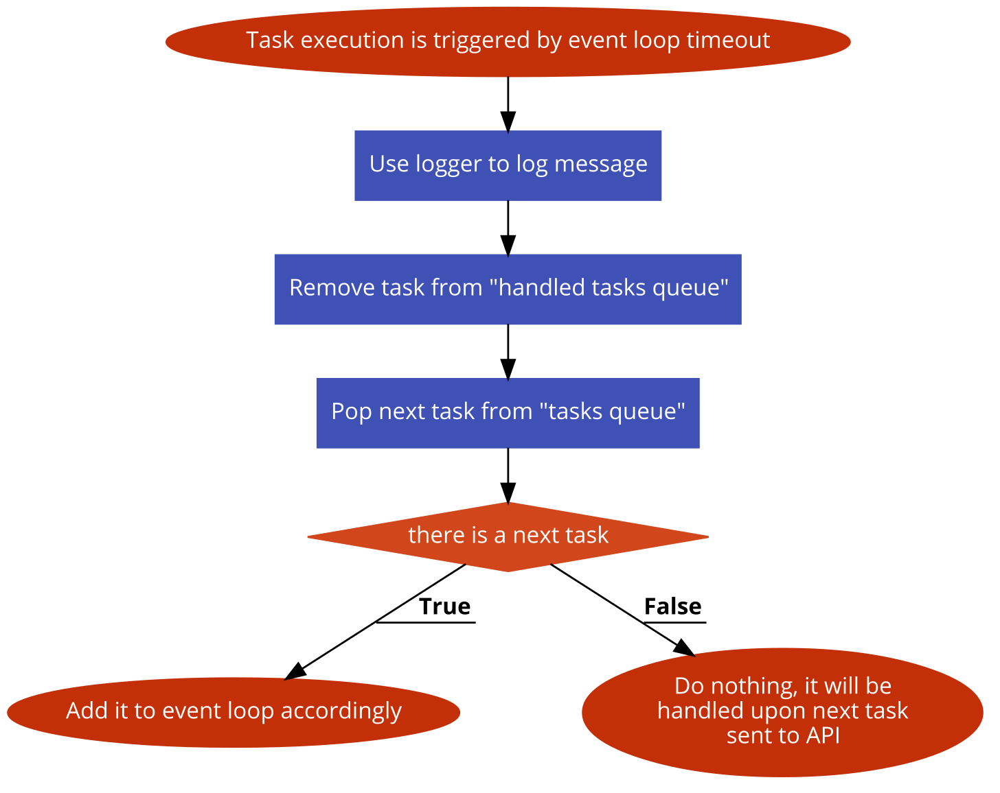
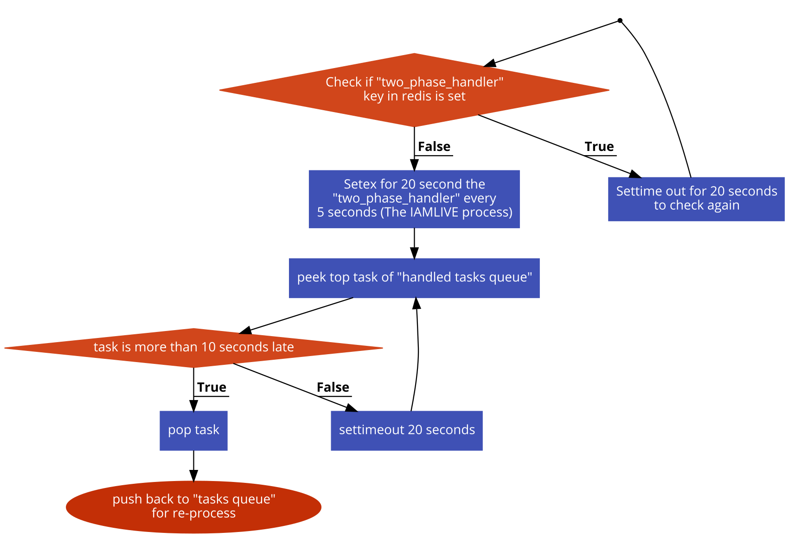

# Moonactive coding challenge - Snir David
Original challenge text:
```
Your task is to write a simple application server that prints a message at a given time in the future.

The server has only 1 API:
echoAtTime - which receives two parameters, time and message, and writes that message to the server console at the given time.

Since we want the server to be able to withstand restarts it will use redis to persist the messages and the time they should be sent at. You should also assume that there might be more than one server running behind a load balancer (load balancing implementation itself does not need to be provided as part of the answer)

In case the server was down when a message should have been printed, it should print it out when going back online.

The focus of the exercise is the efficient use of Redis and its data types as well as seeing your code in action. You can implement the exam in any language of your choice (preferably in NodeJS).
```

## Printing at time
The core complexity in this task is to store in redis, and then use the storage to print statements at the correct time.

### Naive approach
The naive implementation would be to store the tasks in a sorted set, where ranks would be the timestamp in ms of when it should be printed.
Then we will have a loop to check up redis every second or so for the top of that set, and if the time elapsed it will print it.

This will of course work, but will be very wasteful in resources since we will query redis every second. Redis is also single threaded so having that load, when assuming we will have many servers, will create internal queue in redis that might at some point make us miss by more than a second.

### Sleep approach
A more effective approach would be to get the head of the list, and schedule internally the program to wake up at that time and print the statement.

This will make every program do one read from redis for each print, optimistically.

But it does present new issues:
- What will happen if the process got shutdown in the meantime
- What will happen if we have just 1 server, preoccupied, but we inserted a new task that is actually earlier than the one it already have

#### Protection against shutdown
Say we got a task from our main "queue". It is now removed from the main queue and awaits running in some process (in nodejs case, awaits in the eventloop for its time).
If the process goes down, the task is gone forever.

There are 2 possible way to deal with it that I can think of:
1. Some kind of 2-phase-commit, where we will store these tasks in another queue of "taken" tasks, that will expect to be removed from there once the task is completed.
We will have a single process at all time watching this queue, every second or so (Still much better that all process checking up the main queue every second) and if it sees a task not removing 5 seconds after its due, it will re-add it to the main queue.
Other processes will query redis every 20 seconds for IAMLIVE signals of the single process that handles the 2 phase commit. Should there not be a signal, the first process will take over.
(A note on efficiency here - this is also a process that queries redis every X seconds. but not every 1 second as in the naive approach. Also, for certain scales we can strip that for a separate service called the `2phaseHandler` and have highly available setup of 3 servers only, while printers there might be thousands).
2. "High availability approach", where every task is assigned to at least 2 servers. The second server is the "back up" server that will have the task assigned to print 5 seconds late. Once a task is printed, it will be added as a key "{timestampms}_{encode64 of message}" using SETEX for 20 seconds. Upon printing, servers will query redis to see if the key is there. The 5 seconds difference is a naive approach to prevent race conditions but can be good enough for most cases, of course, depending on the application demands and necessary gurantees.

Both approaches are generic protection for distributed "high risk" systems. I will go with the first one.

#### List updated event
When a new task is inserted, even if all servers are preoccupied with other tasks, it should still get in.
I will handle it within the `add_task` API directly, assuming the api server is also the printing server.

For simplicity, I will just check if its current task is later than the task inserted, pop out the current task, move it back into redis, and use the incoming task.

I will not just add the new task to the local event loop - to prevent a case where I have millions of tasks inserted in reverse order, that will bring down my server.

## Implementation details
### Redis data structures
- `main_queue` - Type {Sorted Set} I will use the rank as timestamp in ms for the message to be printed.
- `handled_tasks` - Type {Sorted Set} Same as the `main_queue` for tasks already been pulled by processes into their event loop. Processes will be responsible to remove tasks from here upon printing, and we will have a signle handler at all time to look at this queue, and if it will recognize a miss it will re-add to `main_queue` to be taken care of by other process.
- `two_phase_handler` - Type {Expired key} will be set to be expires in 20 seconds. This is the IAMLIVE marker for the process that will handle the 2 phase commit. It will re-write to it every 5 seconds. Factor of 4 from TTL is enough abstraction here not to get worried about temporary network issues.

### A note about serialization
In the tasks queues, I will keep the content, the value of each element in the sorted set, as encoded with message time, to make the item unique.

`336236437347::My Message`

For example.

This way, I can store several times the same message in sorted -- set --.
I can also remove by the encoded value directly, without fear of shadowing in this kind of data structure.

## Workflow diagrams
### Server initialization


### Add task to event loop


### Task execution


### Two phase handler


# Setup instructions (Ubuntu)
Assuming you have node on your machine:

Install yarn:
`npm i -g yarn`

Install packages:
`yarn i`

Install redis:
`sudo apt install redis-server`

Go to redis config:
`sudo nano /etc/redis/redis.conf`

and on the line that says `supervised no` change to `supervised systemd` to have systemd take control of the service

restart redis:
`sudo systemctl restart redis.service`

# Running instructions
Run the server by using
```
yarn start
```

If you only want to see task logs, add:
```
yarn start | grep TASKED
```

Example of sending a message in by cURL:
```
curl -X POST \
  http://localhost:7070/echoAtTime \
  -H 'Content-Type: application/json' \
  -d '{
	"message": "SNIR",
	"time": 235326235151
}'
```